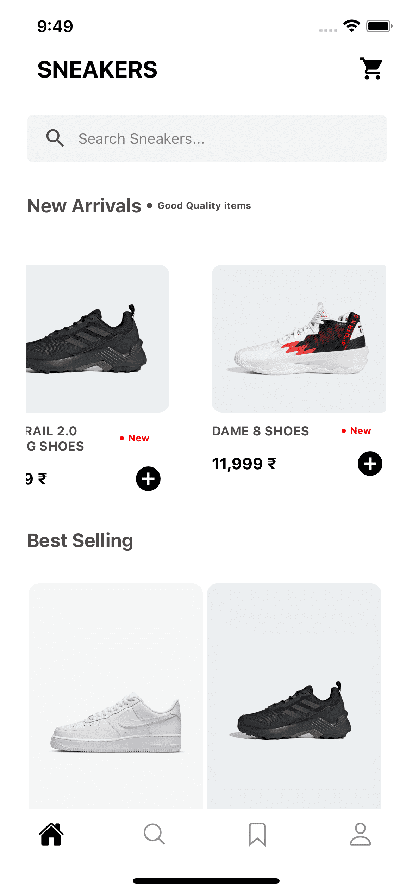
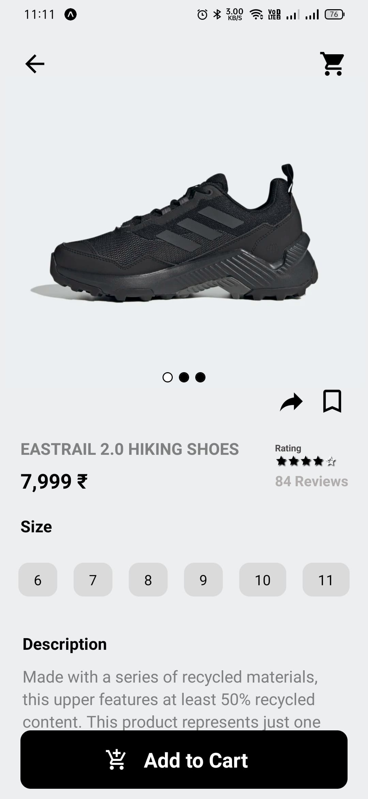
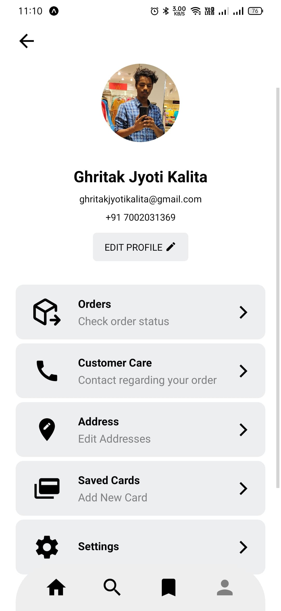
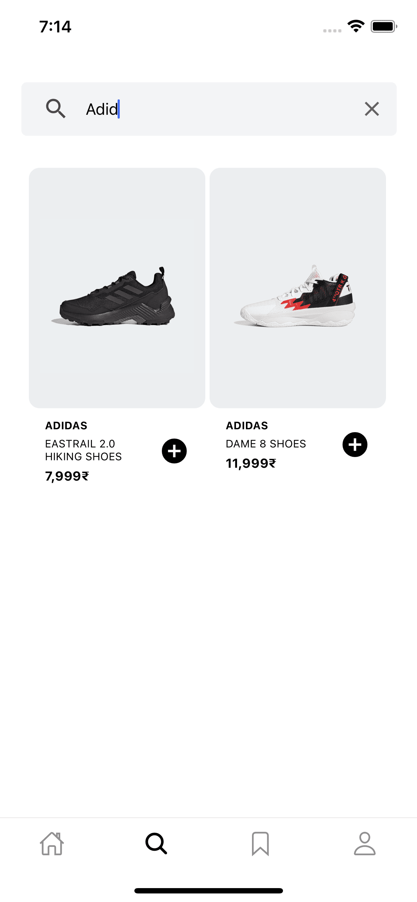
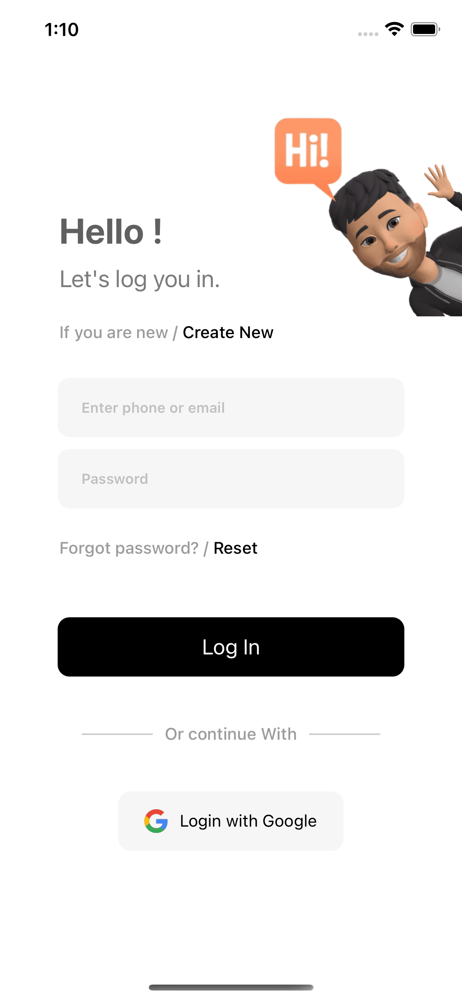
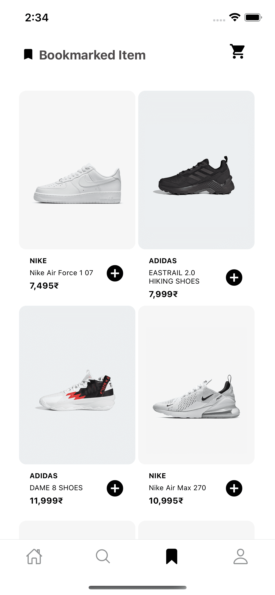
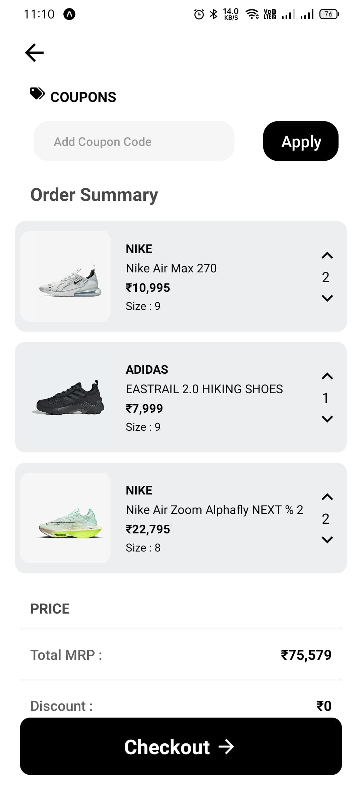

<h1>Hi there 👋🏽</h1>

- This is a front end React Native app developed by me during my learning stage.
- This app is supported in both IOS and android.
- Below I have attached some screenshots of the UI

  
  
  
  

  
  
  
  

