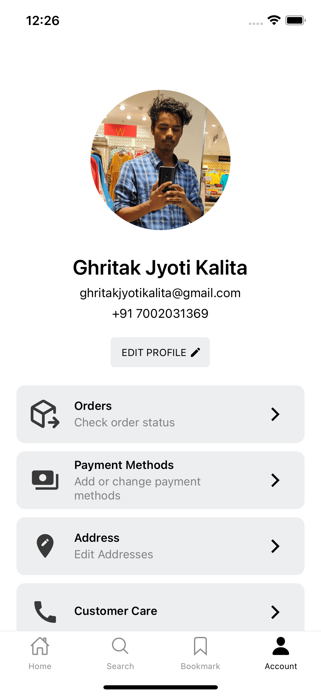

# Sneakers Mobile App

## Overview

Sneakers is a React Native mobile application designed to offer users a convenient shopping experience on their smartphones. The app provides essential eCommerce functionalities, allowing users to browse products, add them to their cart, and proceed with a basic checkout process.

## Features

- **User-friendly Interface**: A clean and intuitive interface for easy navigation.
- **Product Catalog**: Displaying a selection of products available for purchase.
- **Cart Management**: Enable users to add products to their cart and review their selections.
- **Basic Checkout Flow**: Simple checkout process for users to complete their purchases.
- **Responsive Design**: Ensuring a seamless experience across various screen sizes.

## Screenshots

  
  
  
  

  
  
  
  

  

## Getting Started

To run the app locally:

1. Clone the repository.
2. Navigate to the project directory.
3. Install dependencies.
4. Start the development server.
5. Use Expo Go app on your device or simulator/emulator to preview the app.

## Contact

For questions or feedback, feel free to reach out to us at [ghritakjyotikalita@gmail.com].
